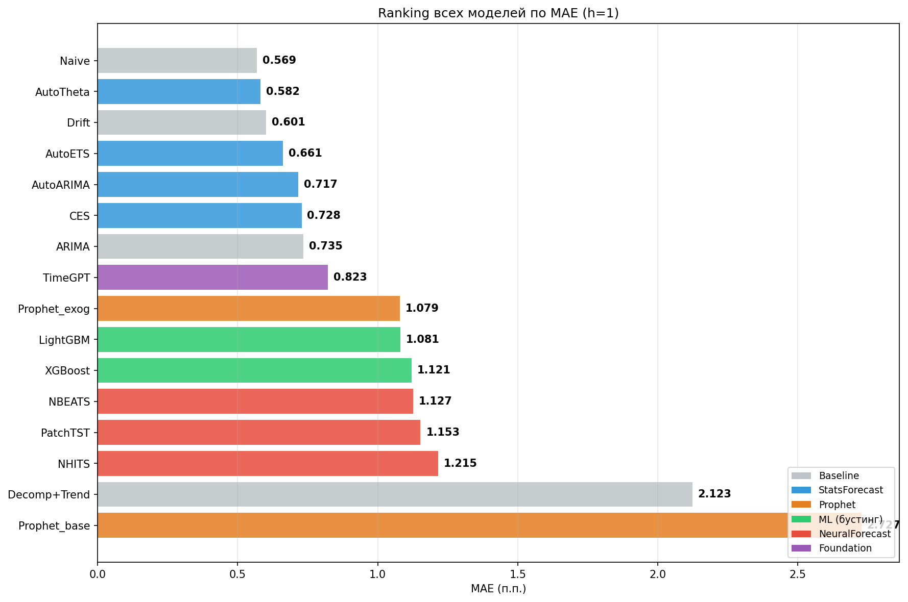

# Прогнозирование ключевой ставки Банка России

Выпускная квалификационная работа, МАИ, 2026, прикладная математика.

**Вопрос работы:** превосходят ли статистические модели, градиентный бустинг, нейросети и
foundation-модели наивный прогноз ключевой ставки на горизонте 1 месяц?

**Короткий ответ:** нет.

## Главный результат

Сравнение 16 моделей на 91 прогнозе (валидация expanding window, горизонт 1 месяц):

| Модель | MAE, п.п. | RMSE | MAPE, % |
|---|---|---|---|
| **Naive** | **0.569** | 1.563 | 4.78 |
| AutoTheta | 0.582 | 1.568 | 4.90 |
| Drift | 0.601 | 1.569 | 5.05 |
| AutoETS | 0.661 | 1.666 | 5.73 |
| AutoARIMA | 0.717 | 1.638 | 5.87 |
| TimeGPT | 0.823 | 1.707 | 6.66 |
| LightGBM | 1.081 | 1.946 | 8.93 |
| N-BEATS | 1.127 | 2.175 | 9.12 |

Полная таблица — [`results/metrics_final_all.csv`](results/metrics_final_all.csv).

Тест Диболда–Мариано (функция потерь — абсолютная ошибка) показал, что наивный прогноз
значимо точнее 11 из 12 моделей, с которыми сравнивался; незначимым оказалось только
различие с AutoETS (p = 0.13). Модели разбиваются на три группы по качеству:

1. наивный прогноз;
2. статистические методы (AutoTheta, Drift, AutoETS, AutoARIMA, CES, ARIMA) и TimeGPT;
3. ML-модели (LightGBM, XGBoost) и нейросети (N-BEATS, N-HiTS, PatchTST).



Матрица p-value теста Диболда–Мариано — [`results/dm_test_results.csv`](results/dm_test_results.csv)
и [`docs/img/comparison_01_dm_matrix.png`](docs/img/comparison_01_dm_matrix.png).

**Проверка на другой стране.** На данных Национального банка Казахстана (базовая ставка,
2020–2026) вывод повторился: наивный прогноз лучший, MAE 0.209 п.п. против 0.263 п.п. у
лучшей из альтернатив ([`results/kz_comparison_ru_vs_kz.csv`](results/kz_comparison_ru_vs_kz.csv)).

**Вероятное объяснение.** Банк России меняет ставку редко — 8 плановых заседаний в год,
поэтому месячный ряд почти всегда постоянен, и персистентный прогноз трудно превзойти
при горизонте в один месяц. Сложные модели в такой задаче добавляют дисперсию, а не точность.

## Калибровка интервальных прогнозов

| Модель | Покрытие 90% | Покрытие 95% | Средняя ширина 95% CI, п.п. | Метод |
|---|---|---|---|---|
| AutoARIMA | 92.3% | 94.5% | 4.71 | аналитический |
| AutoETS | 96.7% | 96.7% | 6.00 | аналитический |
| CES | 95.6% | 96.7% | 5.17 | аналитический |
| AutoTheta | 95.6% | 95.6% | 4.66 | аналитический |
| Prophet-base | — | 79.5% | 9.32 | Монте-Карло |
| Prophet-exog | — | 92.0% | 3.84 | Монте-Карло |
| LightGBM | — | 67.5% | 8.45 | квантильная регрессия |

Калибровка ухудшается с ростом сложности модели. Параметрические модели оценивают
дисперсию остатков аналитически и держат покрытие близко к номиналу; Prophet строит
интервалы симуляцией и занижает хвосты; квантильная регрессия на 60–136 обучающих
наблюдениях почти не видит экстремальных значений и даёт 67.5% вместо 95%.

При этом точность и калибровка — разные вещи: у наивного прогноза MAE 0.569 п.п.,
а ширина интервалов у статистических моделей 4.7–6.0 п.п. Интервалы покрывают факт,
но слишком широки, чтобы быть полезными для решений.

Данные по статистическим моделям — [`results/sf_coverage.csv`](results/sf_coverage.csv);
значения для Prophet и LightGBM взяты из текста работы (шаг 05 в текущем окружении
не запускается из-за конфликта версий библиотек).

## Что дальше

- Конформное предсказание (conformal prediction) для калибровки интервалов ML-моделей:
  оно гарантирует номинальное покрытие при минимальных предположениях о распределении.
- Длинные горизонты: ablation-эксперимент показал, что ценность экзогенных признаков
  растёт с горизонтом, поэтому на h = 12 наивный прогноз может потерять преимущество.
- Событийная шкала вместо месячной: решения принимаются на 8 заседаниях в год.
- NLP-обработка пресс-релизов Банка России: сигналы о намерениях регулятора не отражены
  в числовых индикаторах.

## Данные

[`data/dataset_monthly.csv`](data/dataset_monthly.csv) — 151 месяц, сентябрь 2013 — март 2026,
32 макроэкономических признака.

| Источник | Что берётся | Как |
|---|---|---|
| Банк России | ключевая ставка, кривая бескупонной доходности | ставка внесена вручную по таблице решений; кривая — парсинг сайта (requests + BeautifulSoup) |
| Росстат | ИПЦ, ИПП, ВВП, M2 | выгрузки Excel |
| Московская биржа | USD/RUB, RUONIA, ROISFIX | выгрузки |
| FRED | Brent | API (`fredapi`), ключ `FRED_API_KEY` |
| Нацбанк Казахстана | базовая ставка, 2020–2026 | [`data/kz_base_rate_monthly.csv`](data/kz_base_rate_monthly.csv), [`data/kz_nixtla.csv`](data/kz_nixtla.csv) |

Квартальный ВВП интерполирован до месячной частоты линейно.

## Как воспроизвести

```bash
python -m venv .venv
.venv\Scripts\activate            # Linux/macOS: source .venv/bin/activate
pip install -r requirements.txt

copy .env.example .env            # и вписать свои ключи
```

Скрипты запускаются по порядку номеров. Пути берутся из `src/paths.py`, поэтому запускать
можно из любой папки. Данные читаются из `data/`, графики и промежуточные таблицы пишутся
в `figures/`. Шаг 10 собирает прогнозы всех предыдущих шагов, поэтому идёт последним.

```bash
python src/01_data_collection.py
python src/02_eda.py
...
python src/10_comparison.py
```

Шаг 01 докачивает часть источников по API, а часть ожидает ручные выгрузки
(`m2_raw.xlsx`, `cpi_raw.xlsx`, `gdp_raw.xlsx`, `ipp_raw.xlsx`, `ruonia.xlsx`) в рабочей папке.
Готовый датасет уже лежит в `data/`, так что для воспроизведения результатов шаг 01
запускать не обязательно.

## Структура

```
.
├── src/        код по шагам анализа
├── data/       исходные данные
├── results/    итоговые таблицы: метрики, тест Диболда–Мариано, сравнение с Казахстаном
├── docs/img/   иллюстрации для README
└── figures/    рабочие графики (создаётся при запуске, в репозитории не хранится)
```

| Файл | Что делает |
|---|---|
| `src/01_data_collection.py` | сбор и склейка датасета из всех источников |
| `src/02_eda.py` | описательные статистики, тесты стационарности, автокорреляции |
| `src/03_baseline.py` | бенчмарки: Naive, Drift, ARIMA, Decomp+Trend |
| `src/04_statsforecast.py` | AutoARIMA, AutoETS, AutoCES, AutoTheta; покрытие интервалов 90% и 95% |
| `src/05_prophet.py` | Prophet с экзогенными признаками и без, калибровка интервалов |
| `src/06_mlforecast.py` | LightGBM, XGBoost; квантильная регрессия; SHAP, permutation importance, ablation |
| `src/07_two_stage_h3.py` | двухэтапный прогноз на горизонте 3 месяца с прогнозом экзогенных признаков |
| `src/08_neuralforecast.py` | N-BEATS, N-HiTS, PatchTST (seed = 42) |
| `src/09_foundation.py` | TimeGPT и Chronos-Bolt в режиме zero-shot |
| `src/10_comparison.py` | сводные метрики, тест Диболда–Мариано, рейтинг моделей |
| `src/11_reversed.py` | обратная задача: отклик RUONIA и ROISFIX на изменение ставки |
| `src/12_kazakhstan.py` | проверка выводов на данных Казахстана |
| `src/paths.py` | общие пути проекта |

## Ограничения

- 151 месячное наблюдение — небольшая выборка для 32 признаков и 16 моделей. Результат
  получен на горизонте 1 месяц и не переносится автоматически на длинные горизонты.
- Казахстанский ряд короче российского (с 2020 года), поэтому проверка устойчивости
  опирается на меньшее число точек.
- Таблица вычислительной сложности (`results/computational_complexity.csv`) заполнена
  вручную по замерам на одной машине и не воспроизводится автоматически.
- Значения ключевой ставки внесены вручную по таблице решений Банка России.
